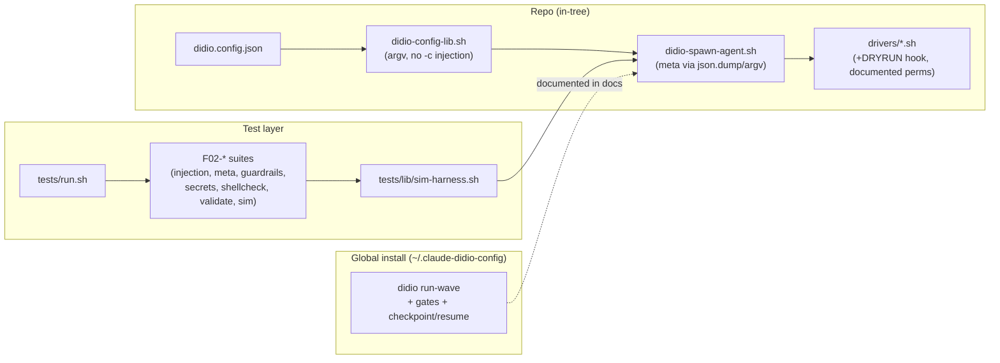

# Task F02-T12 — F02 architecture diagram + ADR + README note

**Feature:** F02
**Wave:** 3
**Type:** docs
**Depends on:** F02-T04..T11 (documents what shipped)
**Status:** done
**Maps to AC:** AC9

## User Story

As a maintainer, I want the hardening + flow reconciliation captured in a
living architecture diagram, an ADR, and a README note, so that the decisions
are discoverable and the project gates (diagram + README on every feature) are
met.

## Objective

Create `docs/diagrams/F02-architecture.mmd`, a new ADR for the F02 hardening
decisions, and add an F02 note to `README.md`.

## Dev Notes

Veja `_brief/00-overview.md`, `_brief/01-flow-orchestration.md`,
`_brief/04-security-hardening.md`.

- ADR numbering: `docs/adr/` has `0000-template.md`, `0001`, `0002`, `0003`.
  Next is `0004-framework-hardening.md`. Follow `0000-template.md` structure.
- Diagram template: `docs/diagrams/templates/architecture.mmd` (`flowchart LR`,
  subgraphs per layer). Show the layers F02 touched: **repo** (spawn-agent,
  config-lib, drivers, tests) vs **global install** (run-wave + gates), the
  security boundaries (argv-passing, dry-run hook, secrets/.gitignore), and the
  test layer (run.sh → F01/F02 suites + sim-harness).
- **Single-writer:** this task owns `docs/diagrams/F02-architecture.mmd`,
  `docs/adr/0004-*.md`, `README.md`. T13 owns only the journey diagram.
- README rule (CLAUDE.md): every shipped feature updates README with what
  changed (new test runner, hardened scripts, driver dry-run hook, doc
  reconciliation).

## Implementation details

- ADR `0004-framework-hardening.md`: context (audit findings D1–D6, A1, B),
  decision (argv/env over `python3 -c` interpolation; documented driver
  permission posture + opt-in dry-run; test runner + sim harness as the
  project's quality gate; doc-vs-global-CLI reconciliation), consequences,
  alternatives considered.
- `docs/diagrams/F02-architecture.mmd`: stub below, refined to match final code.
- `README.md`: add an "F02 — Framework hardening" bullet block.

## Architecture diagram stub (refine to match shipped code)

## Acceptance criteria

- [ ] `docs/diagrams/F02-architecture.mmd` exists, is valid Mermaid, and
      reflects the layers/boundaries actually changed by T04–T11.
- [ ] `docs/adr/0004-framework-hardening.md` follows the template and records
      the injection-fix, driver-permission, test-runner, and doc-reconciliation
      decisions with alternatives + consequences.
- [ ] `README.md` has an F02 note listing the delivered changes.
- [ ] No code behavior change (docs only).

## Testing

- Framework: docs. Validate Mermaid renders (no syntax error) and ADR/README
  links resolve. Picked up by `tests/F02-docs-consistency.sh` only insofar as
  it doesn't introduce bad `didio` tokens.

## Test scenarios

- **Happy path:** diagram renders; ADR + README present and accurate.
- **Edge case:** diagram includes the global-vs-repo boundary (matches T10).
- **Error scenario:** stale claim (e.g. README says a script unchanged when it
  was) — cross-check against the shipped tasks before finalizing.
- **Boundary:** ADR number is unique (0004) and template-conformant.

## Diagrams

- **Owns** `docs/diagrams/F02-architecture.mmd`.
