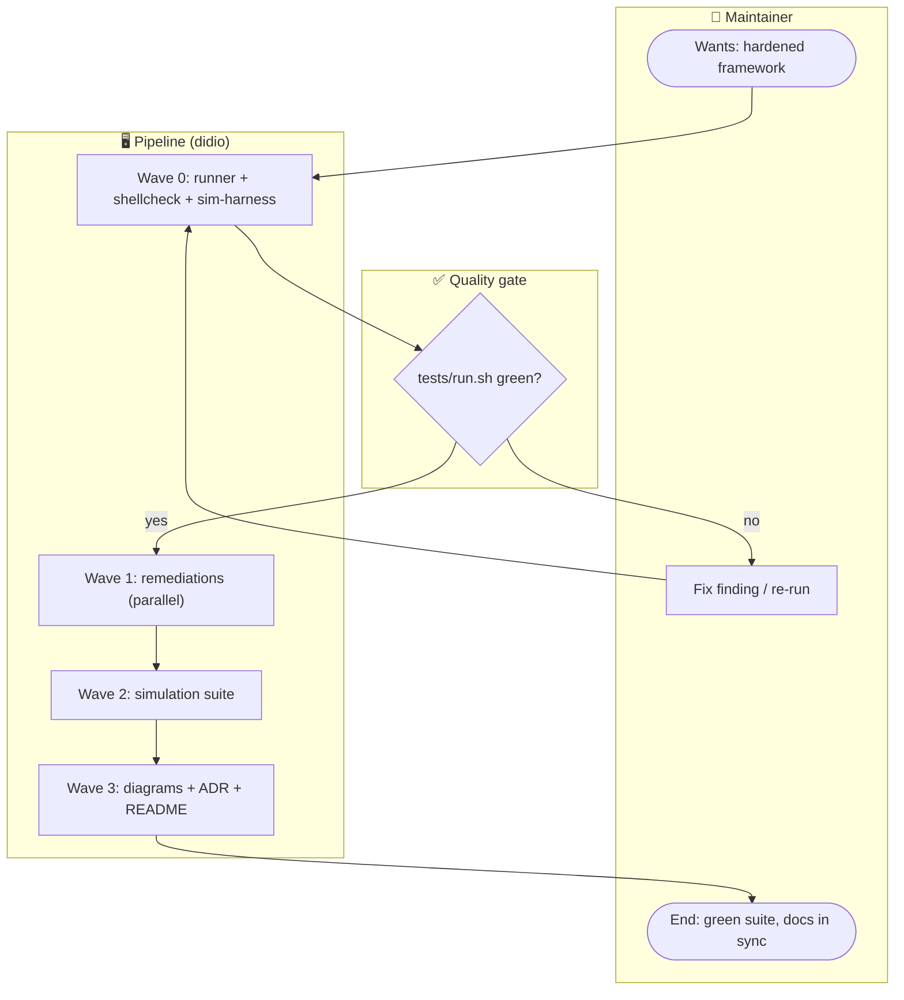

# Task F02-T13 — F02 user-journey diagram (audit → remediate → validate)

**Feature:** F02
**Wave:** 3
**Type:** docs
**Depends on:** F02-T04..T11 (depicts the shipped flow)
**Status:** done
**Maps to AC:** AC9

## User Story

As a maintainer, I want a BPMN-style journey of the hardening workflow, so that
the audit→remediate→validate path (including the per-Wave test gate and failure
branch) is documented as living documentation.

## Objective

Create `docs/diagrams/F02-journey.mmd` showing the maintainer's journey through
the F02 review: trigger the feature, Wave 0 setup, parallel remediation Waves,
the test gate, and the success/failure branches.

## Dev Notes

Veja `_brief/00-overview.md` e `_brief/03-simulation-tests.md`.

- Template: `docs/diagrams/templates/user-journey.mmd` (`flowchart TD` with
  swimlane subgraphs). Use lanes: **Maintainer**, **Pipeline (didio)**,
  **Quality gate (tests)**.
- **Single-writer:** this task owns ONLY `docs/diagrams/F02-journey.mmd`. The
  architecture diagram, ADR, and README belong to T12.
- The journey must reflect the real gate: "no Wave advances without tests"
  (`tests/run.sh` green) and the failure branch (Wave fails → fix → re-run),
  consistent with T10's documentation.

## Implementation details

- `docs/diagrams/F02-journey.mmd`: stub below, refined to match the final
  pipeline wording reconciled in T10.

## Journey diagram stub (refine to match shipped docs)

## Acceptance criteria

- [ ] `docs/diagrams/F02-journey.mmd` exists, is valid Mermaid, uses swimlane
      subgraphs, and shows decision + failure branches.
- [ ] The diagram's test-gate matches the "no Wave advances without tests"
      mandate documented in T10/feature-workflow.
- [ ] No code behavior change (docs only).

## Testing

- Framework: docs. Validate that `docs/diagrams/F02-journey.mmd` renders as
  valid Mermaid with no syntax error (e.g. mermaid CLI or editor preview).
- Scope: swimlane subgraphs present (Maintainer / Pipeline / Gate); the
  test-gate decision node and the failure/loop-back branch are both shown.
- Edge/error: a Wave failure must be a visible branch (not a dead end); the
  `no` branch loops back to fix/re-run, matching T10's documented mandate.

## Test scenarios

- **Happy path:** all Waves pass the gate → reaches "docs in sync" end state.
- **Edge case:** gate `no` branch loops back to fix/re-run.
- **Error scenario:** a Wave failure is visibly represented (not a dead end).
- **Boundary:** swimlanes present (Maintainer / Pipeline / Gate).

## Diagrams

- **Owns** `docs/diagrams/F02-journey.mmd`.
