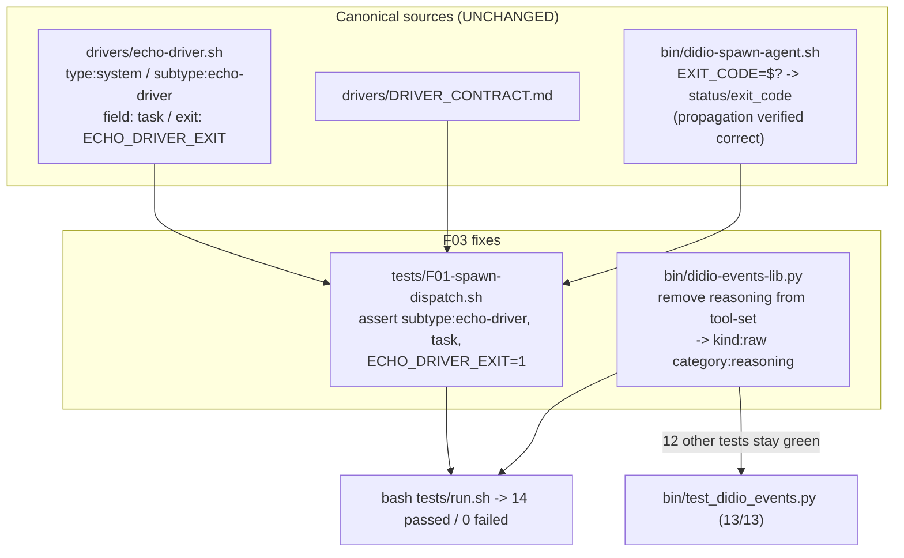
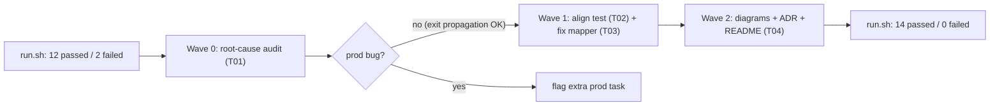

# F03-T04 — Diagrams, ADR 0005 & README note

**Wave:** 2
**Type:** docs
**Depends on:** F03-T02, F03-T03
**Status:** planned

## User Story

As a future maintainer, I want the F03 fix recorded as living documentation
(two Mermaid diagrams, an ADR for the contract decision, and a README note), so
the "tests follow the canonical contract" direction is discoverable and the
gates of `CLAUDE.md` are satisfied.

## Objective

Entregar os dois diagramas F03 obrigatórios, o ADR 0005 que registra a decisão
de contrato, e a nota de feature no README — refletindo o estado final
(14 passed, 0 failed).

## Dev Notes

Veja `_brief.md`, `F03-README.md` e `F03-root-cause.md`. Esta task roda após os
fixes (T02/T03) para descrever o estado real.

Convenções (`CLAUDE.md`): cada feature produz ≥2 diagramas em `docs/diagrams/`
(`<FXX>-architecture.mmd` + `<FXX>-journey.mmd`); ADRs numerados sequencialmente
(próximo livre = `0005`, confirmado: existem 0000–0004); toda feature que
"shippa" atualiza o `README.md`. Templates em
`docs/diagrams/templates/{architecture.mmd,user-journey.mmd}`. ADR template em
`docs/adr/0000-template.md`.

Arquivos a criar/editar:
- `docs/diagrams/F03-architecture.mmd` (novo)
- `docs/diagrams/F03-journey.mmd` (novo)
- `docs/adr/0005-tests-follow-canonical-driver-contract.md` (novo)
- `README.md` (editar: adicionar nota F03)
- `docs/diagrams/README.md` e/ou `docs/adr/`/`docs/README.md` index se houver
  listagem (manter consistência com F01/F02; verificar antes de editar).

## Implementation details

**Diagrama de arquitetura** (`docs/diagrams/F03-architecture.mmd`) — stub:


**Diagrama de jornada** (`docs/diagrams/F03-journey.mmd`) — stub:


**ADR 0005** — seguir `docs/adr/0000-template.md`. Decisão: o
`DRIVER_CONTRACT.md` + echo-driver shipped são a fonte canônica do schema de
eventos e do nome de variável de exit (`ECHO_DRIVER_EXIT`); testes divergentes
são corrigidos para seguir o contrato. Registrar a exceção examinada: o
exit-code NÃO era bug de produção. Status: Accepted. Contexto: falhas
pré-existentes do F01 reveladas pelo runner do F02.

**README** — adicionar nota curta de feature F03 (test reconciliation: F01
spawn-dispatch alinhado ao driver canônico; mapper Codex degrada `reasoning`
para raw; `tests/run.sh` agora 14/14). Seguir o estilo das notas F01/F02
existentes.

## Acceptance criteria

- [ ] `docs/diagrams/F03-architecture.mmd` e `docs/diagrams/F03-journey.mmd`
      existem e são Mermaid válido (renderizam sem erro de sintaxe).
- [ ] `docs/adr/0005-tests-follow-canonical-driver-contract.md` existe,
      Status: Accepted, e registra a decisão + a exceção do exit-code.
- [ ] `README.md` tem a nota de feature F03.
- [ ] Índices de docs (se existirem para diagramas/ADR) listam os novos
      artefatos, consistente com F01/F02.
- [ ] `bash tests/run.sh` → **14 passed, 0 failed** (gate final reafirmado).
- [ ] Nenhuma mudança em código de produção, teste ou driver nesta task.

## Testing

Docs-only. Validação:
```bash
bash tests/run.sh          # confirma 14 passed / 0 failed (estado final)
bash tests/F02-shellcheck.sh   # confirma que nada de shell foi tocado/regrediu
```
Validar sintaxe Mermaid abrindo os `.mmd` (ou via qualquer linter Mermaid
disponível; se ausente, revisão visual contra os templates).

## Test scenarios

- **Happy path:** ambos `.mmd` parseiam; ADR e README presentes; `run.sh` 14/14.
- **Edge:** se algum índice de docs (`docs/README.md`,
  `docs/diagrams/README.md`) referencia F01/F02, F03 é adicionado no mesmo
  padrão (não deixar índice stale).
- **Boundary:** o número do ADR é `0005` (não colidir com 0000–0004 existentes).

## Diagrams

**Owner deste dois diagramas:**
- `docs/diagrams/F03-architecture.mmd` (criar)
- `docs/diagrams/F03-journey.mmd` (criar)
